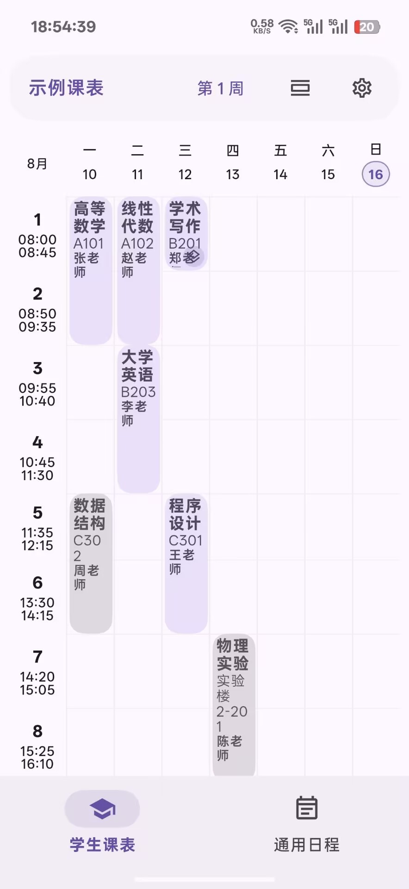
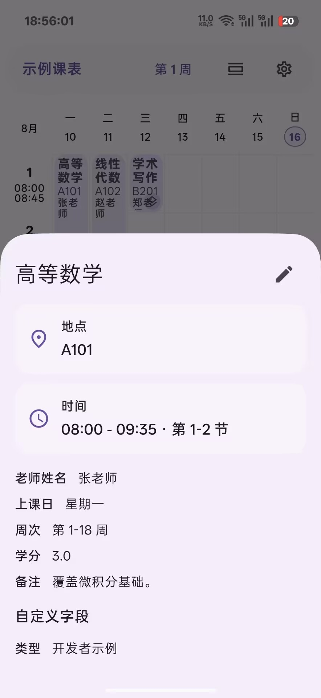
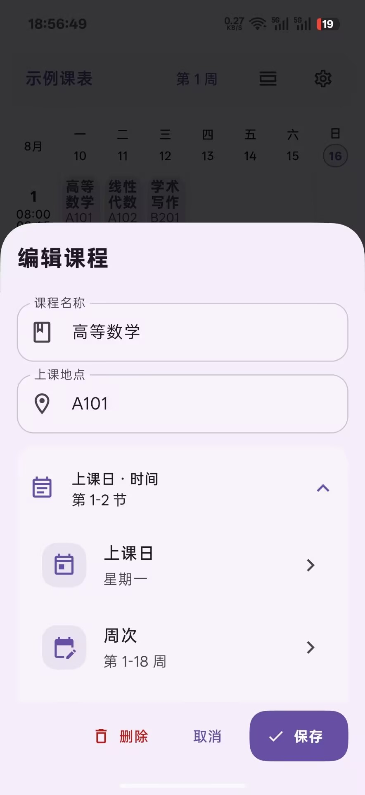
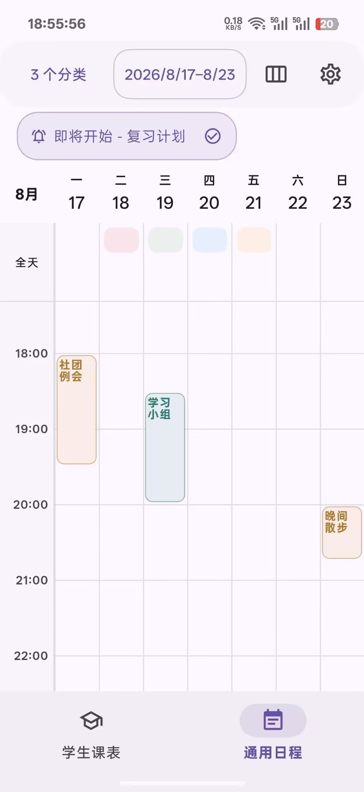
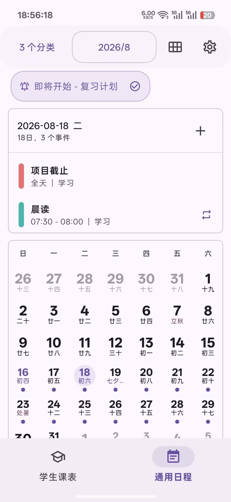
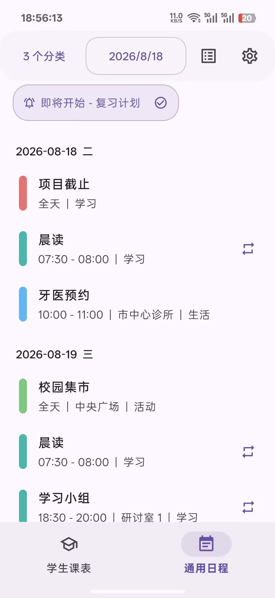
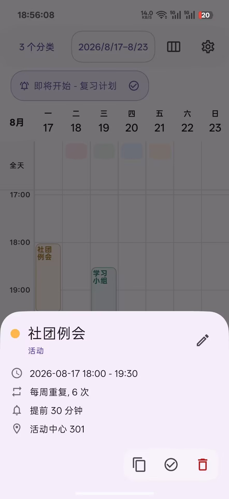
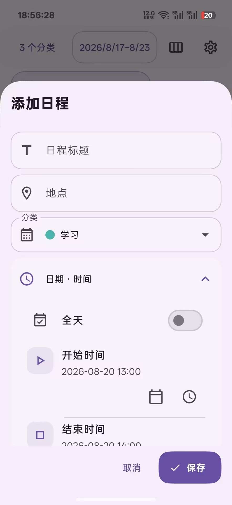
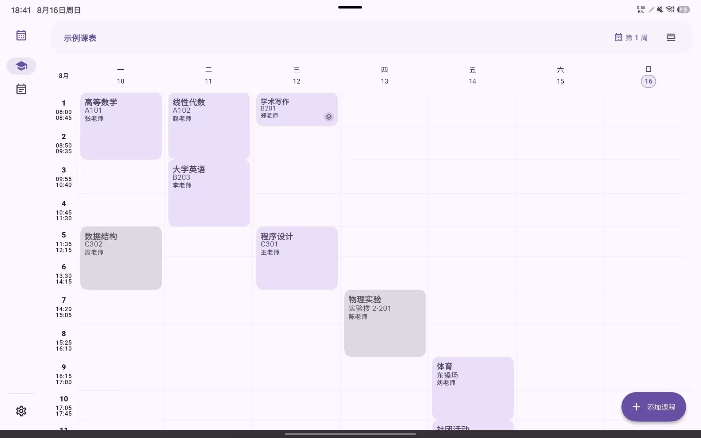
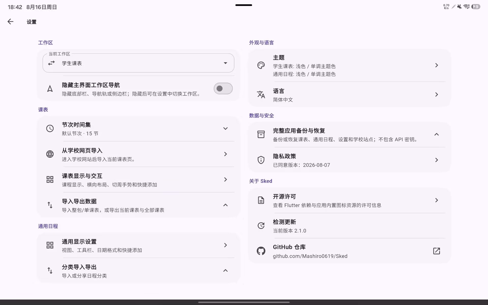

# Sked

课表与日程应用

简体中文 · [English](README_EN.md)

  

Sked 是一款用 Flutter 开发的课表与日程应用。它既可以按学期、周次和节次管理学校课程，也可以用来记录日常安排。两种模式可以随时切换。

## 截图

### Android 手机

  
  
  
  
  
  
  
  

### Android 平板 / Windows 桌面

  
  

## 主要功能

### 学生课表

- 新建、编辑和切换多张课表，按日或周查看课程。
- 按学期起始日和总周数安排课程周次，快速切换日期与教学周。
- 记录课程名称、教师、地点、节次、备注和自定义字段。
- 保存多套节次时间，供不同课表使用。
- 自定义课程颜色、描边、显示内容和课表布局。
- 从 JSON、普通文本、HTML 或学校网页导入课表，并在保存前检查和修改结果。

### 通用日程

- 新建多个日历，在日、周、月和列表视图中查看日程。
- 添加全天或定时日程，设置颜色、备注和所属日历。
- 支持按日、周、月或自定义间隔重复，并可限制次数或结束日期。
- 为日程添加多个应用内提醒。
- 通过 JSON 或 ICS 导入、导出日程。

### 备份、外观与操作

- 完整备份和恢复课表、日程、节次时间集及应用设置。
- 浅色、深色、跟随系统和自定义主题色。
- 可调整课程样式、日期格式、工具栏宽度和常用交互方式。
- 可按需隐藏工作区导航或主界面的悬浮添加按钮。
- 界面会根据手机或桌面窗口尺寸调整，并提供多语言界面。

## 开始使用

首次启动时选择学生课表或通用日程作为起始模式。之后可以在设置中随时切换，也可以选择隐藏主界面的工作区导航。

使用学生课表时，可以先新建课表和节次时间集，再手动添加课程；已有课表也可以直接通过文件、文本、HTML 或学校网页导入。使用通用日程时，先建立日历，然后添加日程或导入 JSON、ICS 文件。

## 下载与平台支持

Android 是 Sked 的主要发布平台，可从 [Google Play](https://play.google.com/store/apps/details?id=com.mashiro.sked) 下载，也可以在本仓库的 [GitHub Releases](https://github.com/Mashiro0619/Sked/releases) 获取 APK。Windows 构建包同样发布在 GitHub Releases。

Windows 通知使用系统 Toast。开发调试可以运行 `flutter build windows --release`；验证包使用 `pwsh -File tool/build_msix.ps1 -Unsigned`。正式发布必须设置 `SKED_MSIX_CERTIFICATE_PATH`、`SKED_MSIX_CERTIFICATE_PASSWORD` 和 `SKED_MSIX_PUBLISHER`，再运行 `pwsh -File tool/build_msix.ps1` 生成签名 MSIX。MSIX 的应用身份用于可靠取消已显示通知。散装 Windows 程序仍可显示和安排通知，但 Windows 不保证它能读取或取消已经进入操作中心的历史卡片。

macOS 和 Linux 目前仅保持源码构建兼容，不提供预编译安装包。项目暂不提供在线 Web 版，也不发布 Web 构建包；仓库中的 Web 工程仅用于保持代码兼容。

## 官方发布渠道

> [!IMPORTANT]
> Sked 的官方版本只通过 Google Play 和本仓库的 GitHub Releases 发布。其他应用商店、下载站、镜像站或分发渠道提供的安装包与衍生版本均不是本项目的官方发布，也未经维护者验证。

未经维护者明确书面授权，第三方不得将自己的渠道或构建版本标注、宣传为“Sked 官方版”“官方镜像”或“官方合作渠道”，也不得以项目名称、图标或维护者身份制造获得官方授权、合作或背书的误解。

本项目目前使用 AGPL-3.0 许可证。在遵守许可证的前提下，任何人都可以再分发源码或自行构建的版本。分发者必须保留许可证及版权声明，并按 AGPL-3.0 提供对应源代码；修改版还须显著说明修改内容和日期。

## 自定义课表解析

从学校网页、文本或 HTML 导入课表时，Sked 可以调用 OpenAI 兼容接口整理课表。项目本身不提供公共解析服务，使用前需要在应用中配置：

- `Base URL`：接口地址，例如 `https://api.example.com/v1`。
- `API 密钥`：接口使用的 Bearer Token。
- `模型`：手动填写，或从接口返回的模型列表中选择。
- `自定义提示词`：可选；留空时使用内置的课表提取提示词。

Sked 通过 `/models` 获取模型列表，通过 `/chat/completions` 解析课表。除可信局域网中的调试接口外，建议使用 HTTPS 地址。

## 参与贡献

欢迎提交 [Issue](https://github.com/Mashiro0619/Sked/issues) 和 Pull Request。提交代码前，请运行格式检查、静态分析和测试，并为新增行为补充相应测试。

学校站点配置位于 [`assets/school_sites.json`](assets/school_sites.json)，也欢迎补充尚未收录的学校。

## 许可证与相关链接

Sked 基于 [GNU Affero General Public License v3.0](LICENSE) 开源。图标等资源的第三方授权说明见 [NOTICE](NOTICE)。依赖库的许可证可在应用内“设置 → 开源许可证”中查看。

- [版本发布](https://github.com/Mashiro0619/Sked/releases)
- [问题反馈](https://github.com/Mashiro0619/Sked/issues)
- [隐私政策](https://sked.mashiro.tech/privacy.html)
