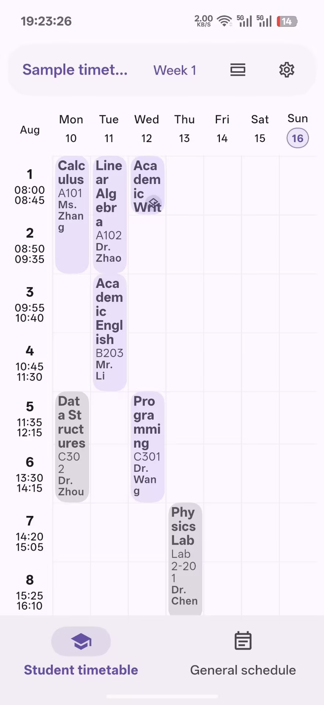
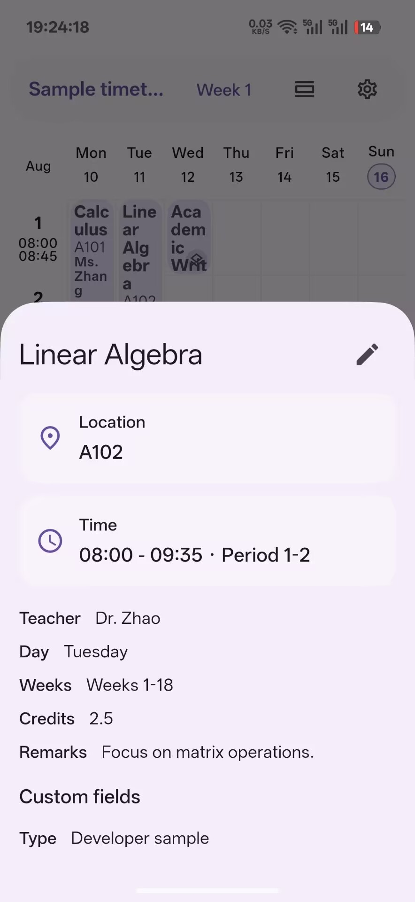
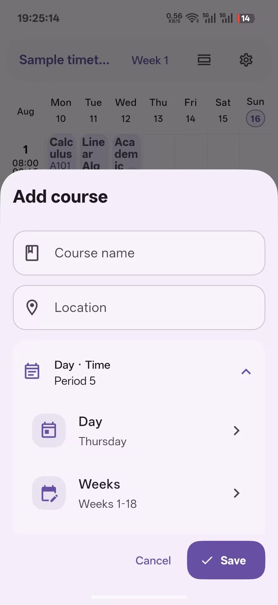
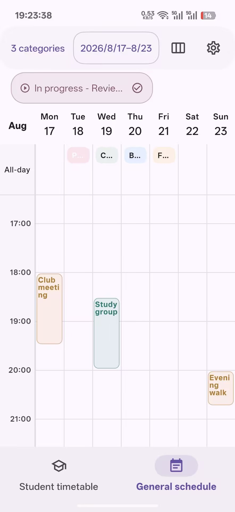
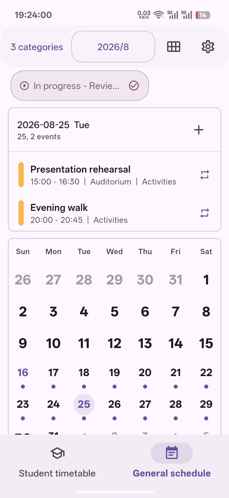
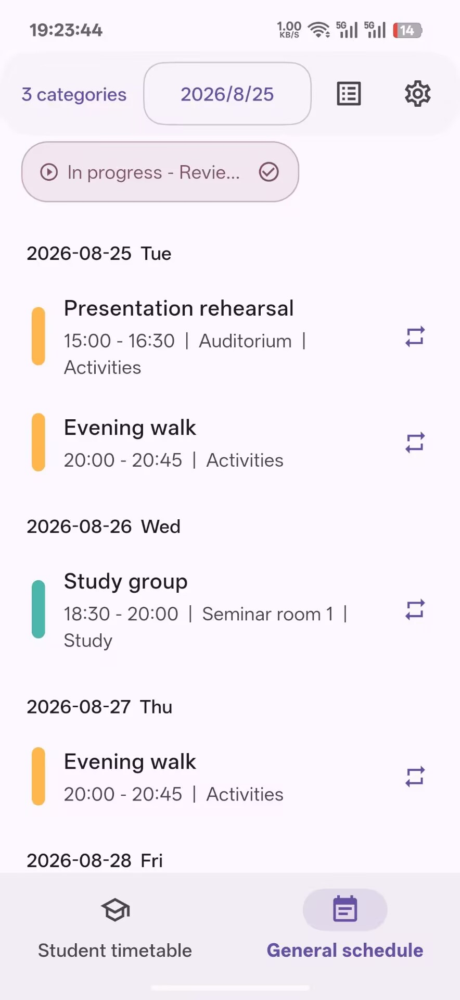
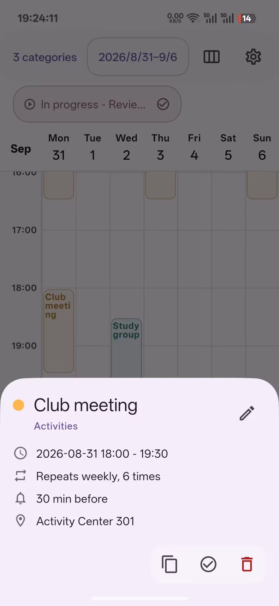
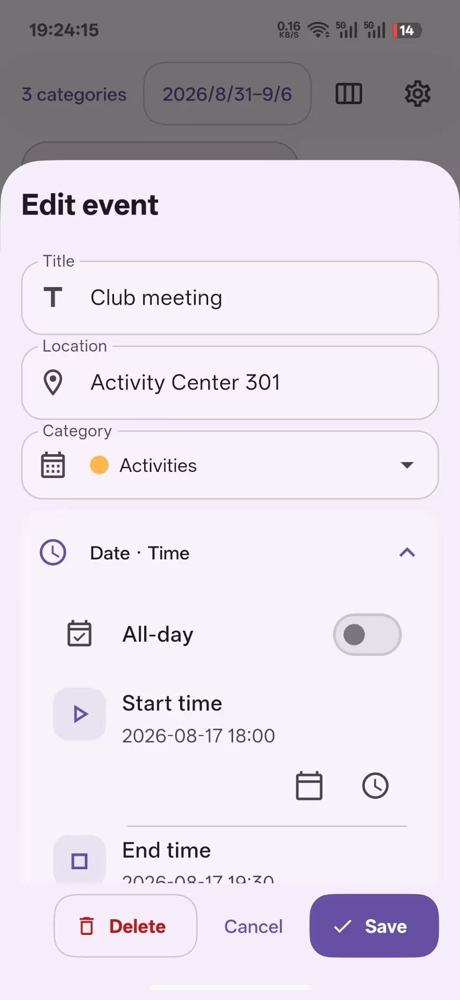
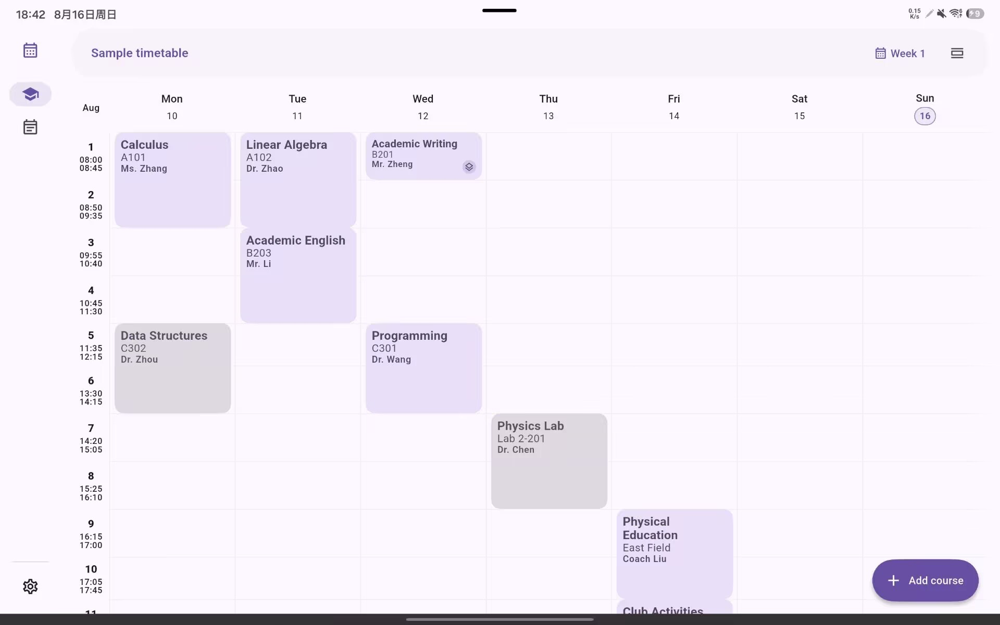
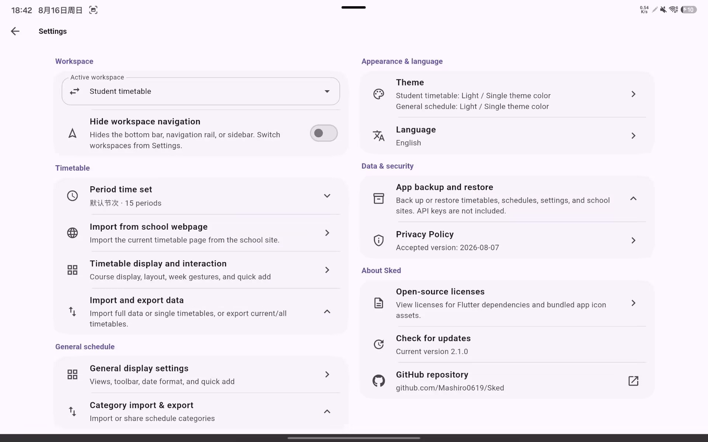

# Sked

A timetable and schedule app

[简体中文](README.md) · English

  

Sked is a Flutter app for student timetables and everyday schedules. Courses are organized by semester, week, and period, while ordinary events are available in day, week, month, and list views. You can switch between the two modes at any time.

## Screenshots

### Android Phone

  
  
  
  
  
  
  
  

### Android Tablet / Windows Desktop

  
  

## Features

### Student Timetable

- Create, edit, and switch between multiple timetables, with day and week views.
- Arrange course weeks from a semester start date and total week count, with quick date and week navigation.
- Record course names, teachers, locations, periods, notes, and custom fields.
- Save multiple period-time sets for use across different timetables.
- Customize course colors, outlines, visible details, and timetable layout.
- Import timetables from JSON, plain text, HTML, or school webpages, with a preview before saving.

### General Schedule

- Create multiple calendars and browse events in day, week, month, or list views.
- Add all-day or timed events with colors, notes, and calendar assignment.
- Repeat events daily, weekly, monthly, or at a custom interval, with count and end-date limits.
- Add multiple in-app reminders to an event.
- Import and export schedules as JSON or ICS.

### Backup, Appearance, and Controls

- Back up and restore timetables, schedules, period-time sets, and app settings.
- Light, dark, system, and custom-color themes.
- Configurable course styles, date formats, toolbar sizing, and common interactions.
- Optional workspace navigation and floating add buttons on the home screen.
- Layouts that adapt to phone and desktop window sizes, with a multilingual interface.

## Getting Started

Choose Student Timetable or General Schedule on first launch. You can switch modes later from Settings and optionally hide the workspace navigation on the home screen.

For a student timetable, create a timetable and period-time set before adding courses, or import an existing timetable from a file, text, HTML, or a school webpage. For general scheduling, create a calendar and then add events or import a JSON or ICS file.

## Downloads and Platform Support

Android is Sked's primary release platform. Install it from [Google Play](https://play.google.com/store/apps/details?id=com.mashiro.sked), or download the APK from this repository's [GitHub Releases](https://github.com/Mashiro0619/Sked/releases). Windows packages are also published through GitHub Releases.

macOS and Linux are currently kept source-build compatible but do not have prebuilt packages. The project does not provide a hosted Web app or publish Web build artifacts; the Web project remains in the repository only for source compatibility.

## Official Distribution

> [!IMPORTANT]
> Official Sked releases are published only through Google Play and this repository's GitHub Releases. Packages and derivative builds offered through other app stores, download sites, mirrors, or distribution channels are not official releases and have not been verified by the maintainer.

Without explicit written authorization, a third party must not claim, label, or promote its channel or build as an "official Sked release," "official mirror," or "official partner," or use the project name, icon, or maintainer identity in a way that falsely implies official authorization, partnership, or endorsement.

Sked is currently licensed under AGPL-3.0. Anyone may redistribute the source code or independently built versions provided that the license is followed. Distributors must preserve the license and copyright notices, provide the Corresponding Source as required by AGPL-3.0, and prominently state the changes and relevant dates for modified versions.

## Custom Timetable Parsing

When importing a school webpage, text, or HTML timetable, Sked can use an OpenAI-compatible API to structure the timetable. The project does not provide a public parsing service, so the following settings must be configured in the app:

- `Base URL`: the API address, for example `https://api.example.com/v1`.
- `API key`: the Bearer token used by the API.
- `Model`: enter a model name or select one returned by the API.
- `Custom prompt`: optional; leave it empty to use the built-in timetable extraction prompt.

Sked uses `/models` for model discovery and `/chat/completions` for timetable parsing. HTTPS is recommended except for trusted local development endpoints.

## Contributing

Issues and pull requests are welcome. Before submitting code, run the formatting check, static analysis, and tests, and add coverage for new behavior.

School-site definitions are stored in [`assets/school_sites.json`](assets/school_sites.json); contributions for unlisted schools are welcome as well.

## License and Links

Sked is released under the [GNU Affero General Public License v3.0](LICENSE). See [NOTICE](NOTICE) for third-party licensing information about icons and other assets. Package licenses are available in the app under **Settings → Open-source licenses**.

- [Releases](https://github.com/Mashiro0619/Sked/releases)
- [Issue tracker](https://github.com/Mashiro0619/Sked/issues)
- [Privacy Policy](https://sked.mashiro.tech/privacy.html)
