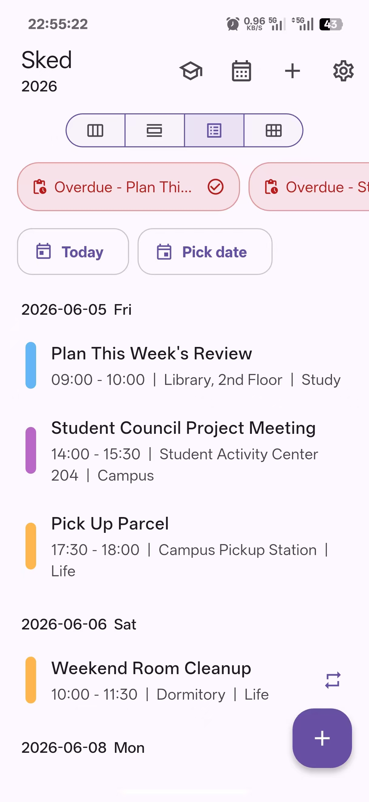
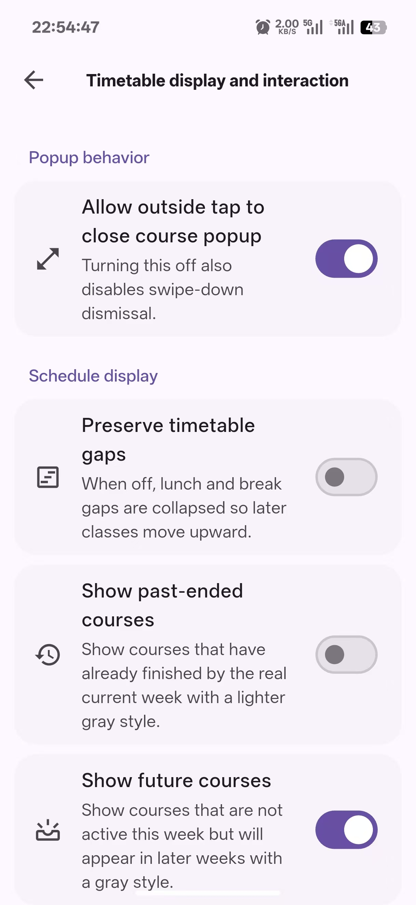
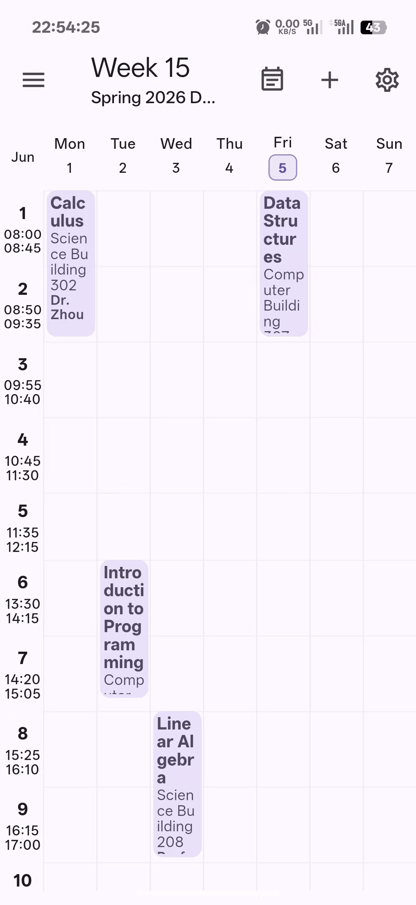
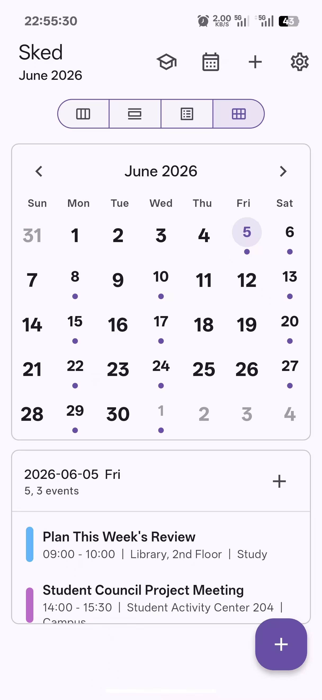
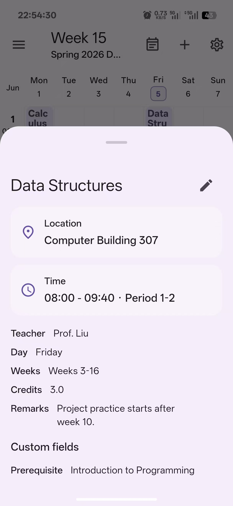
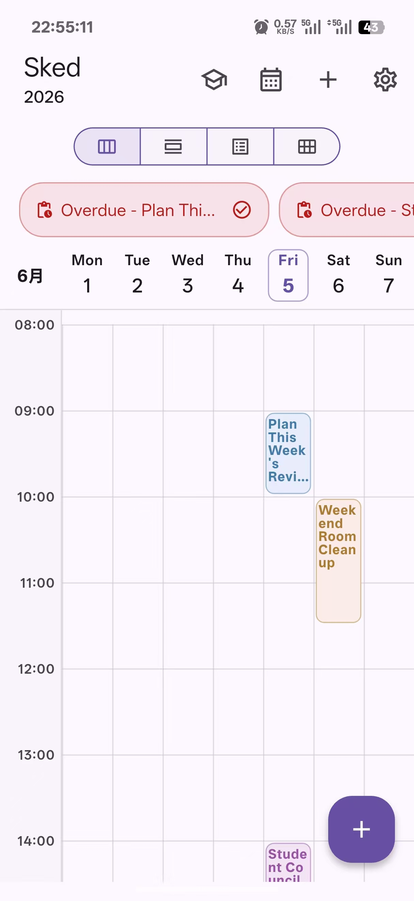
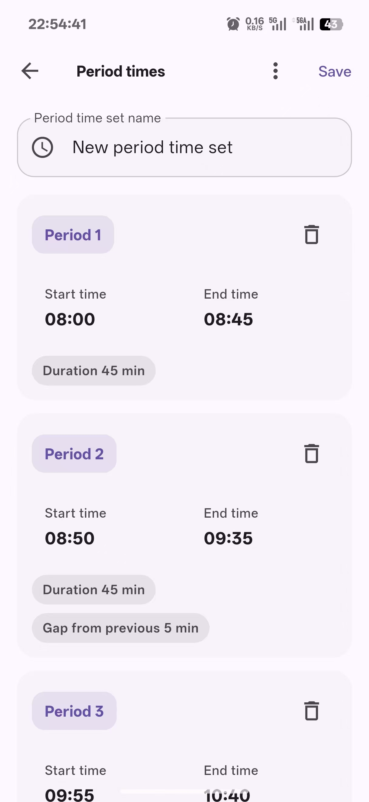

# Sked
### Timetable and schedule manager

<a href="README.md">中文</a>
&nbsp;&nbsp;|&nbsp;&nbsp;
English

  
   
  

Sked helps manage student timetables and everyday schedules in one place. Use it to organize courses, semester weeks, period-time sets, and school sites, or switch to general schedule mode for events, reminders, and recurring plans. It also supports timetable import/export, full app backup and restore, and assisted import from school webpages or text / HTML timetable content through your own parser endpoint.

## Screenshots

## Features

- **Student timetables**: create, switch, edit, and delete multiple timetables, browse by week, and highlight the current or next course.
- **Course editing**: maintain course name, location, teacher, weeks, periods, linked times, notes, and custom fields.
- **Period-time sets**: reuse, edit, import, and export period templates across multiple timetables.
- **General schedules**: manage events, calendars, reminders, recurrence rules, month/day/week views, and list view in a separate schedule mode.
- **Import and export**: handle timetable JSON files, timetable JSON text import / export, general schedule JSON / ICS, school-site JSON, period templates, sharing, and full app backup / restore.
- **Text / HTML parsing import**: open school sites in-app, or paste plain timetable text, page text, or HTML source, then parse timetable data through your own OpenAI-compatible endpoint.
- **Import preview**: review parsed results before saving, choose the period-time set, and decide whether to import as a new timetable or replace the current one.
- **Appearance**: supports light mode, dark mode, system mode, theme colors, colorful UI settings, and an ongoing Material 3 Expressive migration.
- **Data control**: native builds keep timetables, schedules, and settings in the operating system's application-support directory, while browser builds use browser storage; full backups do not include custom parser API keys.

## Data And Privacy

On native platforms, Sked stores student timetables, general schedules, app settings, period-time sets, and school-site configuration in the operating system's application-support directory; browser builds use browser storage. Full app backups export this data, but they do not include custom parser API keys.

When upgrading from an earlier version, files previously written to the user Documents directory remain in place, but the new version does not read or migrate them automatically. To retain that data, export a full app backup from the old version before upgrading, then restore it afterward.

On desktop platforms, after confirming that the old data is backed up or no longer needed and closing Sked, you may selectively delete the old Sked data files, sidecar files, lock files, and recovery directories inside the user Documents directory. The new version does not remove these legacy items for you. On Android, do not manually search for or delete the app's private directories; use **Clear storage / Clear data** in system settings or uninstall the app to remove legacy data. These actions also remove the current version's local data, so create a backup first.

The app reads files, writes files, invokes system sharing, opens external links, checks updates, fetches model lists, imports school webpages, or parses timetable text / HTML content only when you explicitly start the corresponding action.

A privacy policy consent screen is shown on first launch. The full policy is available at [https://sked.mashiro.tech/privacy.html](https://sked.mashiro.tech/privacy.html).

## Custom Parser Endpoint

Sked does not include a built-in timetable parser endpoint. School webpage import and text / HTML parsing import only use the OpenAI-compatible endpoint configured by the user in the app.

Parser settings include:

- `Base URL`: OpenAI-compatible API base URL, such as `https://api.example.com/v1` or a trusted local-network endpoint like `http://192.168.1.10:8000/v1`
- `API key`: Bearer token sent to that endpoint; the app stores it with platform secure storage where available
- `Model`: chat completion model name, entered manually or fetched from the custom endpoint
- `Custom prompt`: optional; when empty, the built-in timetable extraction prompt is used

Request behavior:

- Fetching models requests `/models` under the configured `Base URL`
- Parsing a timetable requests `/chat/completions` under the configured `Base URL`
- Requests include the submitted plain timetable text, page text or HTML content, optional page title, page URL, current app language, and parser prompt content
- If you use an `http://` Base URL, only use it on trusted devices, trusted networks, and trusted endpoint services, because content and API keys may not be protected by transport encryption

## Contributing

Issues and pull requests are welcome. Contributions to `assets/school_sites.json` are also welcome. Please preserve the existing privacy boundaries, data compatibility, and import/export behavior where possible.

## License And Notices

- Source code is licensed under the [GNU Affero General Public License v3.0](LICENSE).
- Bundled launcher icon and platform icon assets include third-party licensed material; see [NOTICE](NOTICE).
- Flutter package and third-party library licenses can be viewed in the app under `Settings -> Open-source licenses`.
